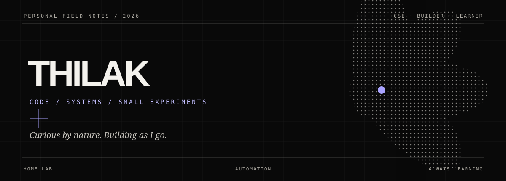

  

  
  
  

 

## 01 / A little about me

Hey, I’m **Thilak** — a Computer Science and Engineering student who likes finding the point where curiosity turns into something useful.

I’m drawn to practical code, the systems that keep it running, and the small automations that make everyday life easier. Most of the time, I’m learning by building.

## 02 / Currently in the workshop

| **HOME LAB** | **LIFE, AUTOMATED** | **NEXT THINGS** |
|:---|:---|:---|
| Building and configuring a home server, one service at a time. | Writing tools and scripts to take repetitive work off my hands. | Exploring frameworks, DevOps, and system administration. |

## 03 / Tools on my desk

**Build**  
   

**Ship & operate**  
   

**Create & collaborate**  
     

## 04 / Outside the terminal

I’m an anime fan, an enthusiastic explorer, and always collecting ideas for the next thing to learn or make.

  MADE OF CURIOSITY&nbsp; · &nbsp;KEPT IN MOTION

